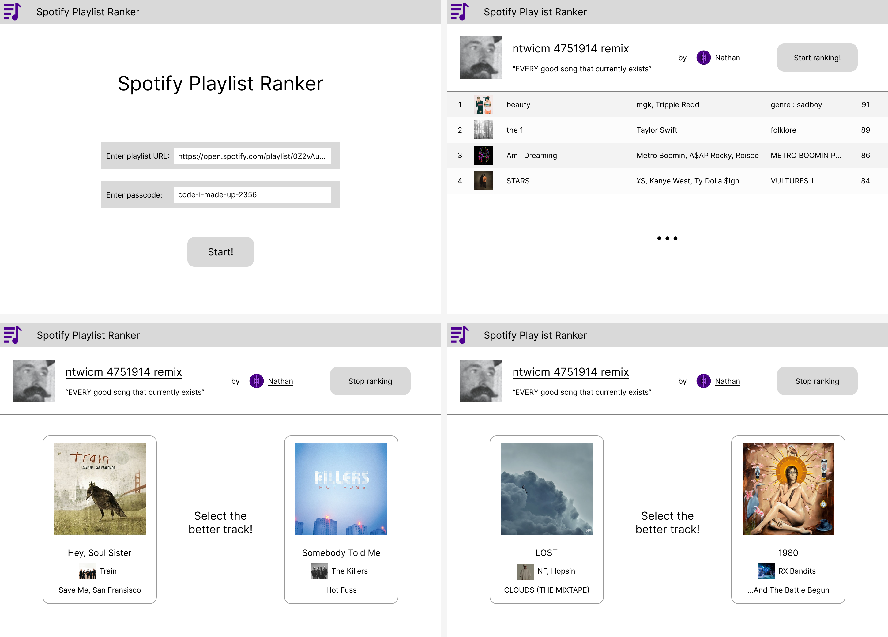

# Spotify Playlist Ranker

Web app for users to rank tracks in a given Spotify playlist, eventually producing a ranked list showing their favorite
tracks.

## Stack

Front-End: React web app using MUI Joy UI

Back-End: Python Flask app

Database: SQLite

The plan is to containerize both into a single Docker container for easy deployment.

## User Interface

The UI will be built in React with MUI Joy UI components.

Figma mockup:

- [Design](https://www.figma.com/file/YcANdKT3sy9axCBssIUqvo/Spotify-Playlist-Ranker?type=design&node-id=0-1&mode=design)
- [Live Preview](https://www.figma.com/proto/YcANdKT3sy9axCBssIUqvo/Spotify-Playlist-Ranker?type=design&node-id=2-2&scaling=min-zoom&page-id=0%3A1&starting-point-node-id=2%3A2)

## Database

The database will be a single, local SQLite database with several tables. See [data/DATABASE.md](data/DATABASE.md).

## Notes

- The point of the whole "passcode" thing is to allow users to have their own unique rankings, without having all the
  overhead of a full account system. But I think at that point it would be better to just have users enter an
  email/password pair so that there's a way to associate rankings with a certain user on the back-end, in case of
  something like password resets, etc.

## Resources

- [Tom Scott: 1,204,986 Votes Decided: What Is The Best Thing?](https://www.youtube.com/watch?v=ALy6e7GbDRQ)
- [How Not to Sort by Average Rating](https://www.evanmiller.org/how-not-to-sort-by-average-rating.html)
- [Python implementation of above (StackOverflow)](https://stackoverflow.com/a/10029645/7492795)
- [MUI Joy UI](https://mui.com/joy-ui/getting-started/)
- [Password Hashing/Salting in Python (StackOverflow)](https://stackoverflow.com/a/56915300/7492795)
- [Python `hashlib` documentation](https://docs.python.org/3/library/hashlib.html)
- [Auth token stuff](https://www.digitalocean.com/community/tutorials/how-to-add-login-authentication-to-react-applications)

## License

All rights reserved to the maximum possible extent.